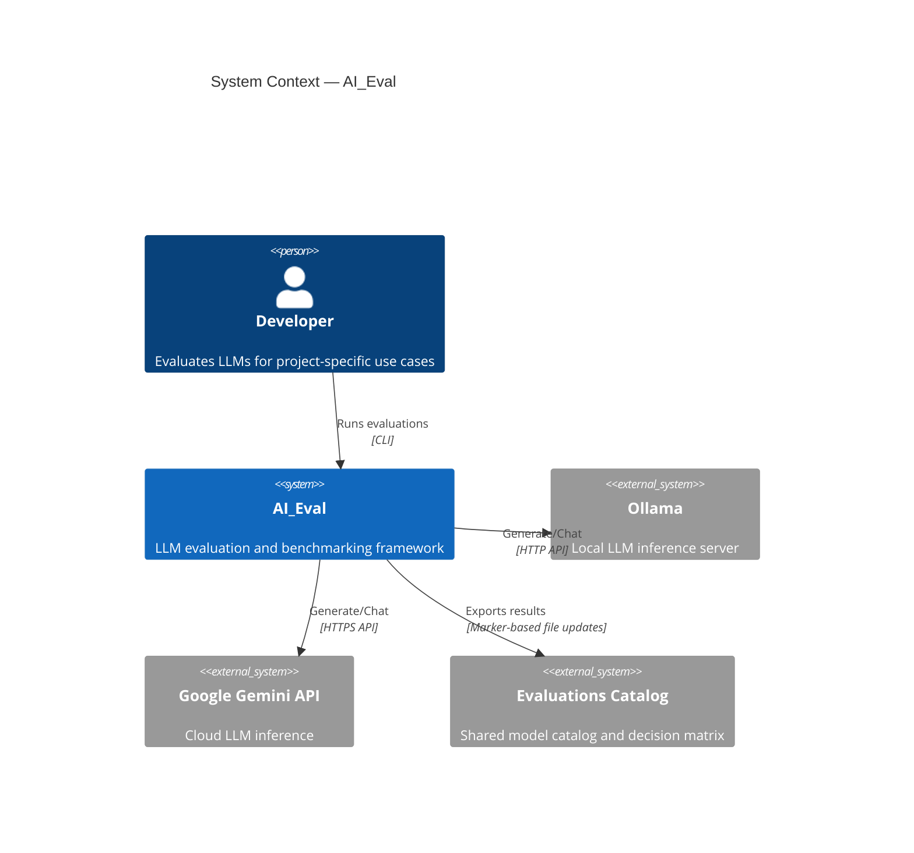
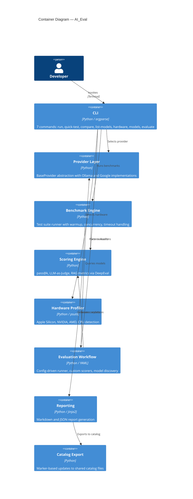
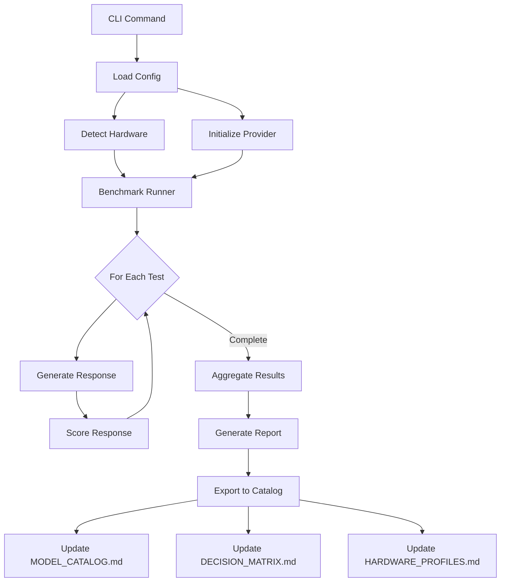
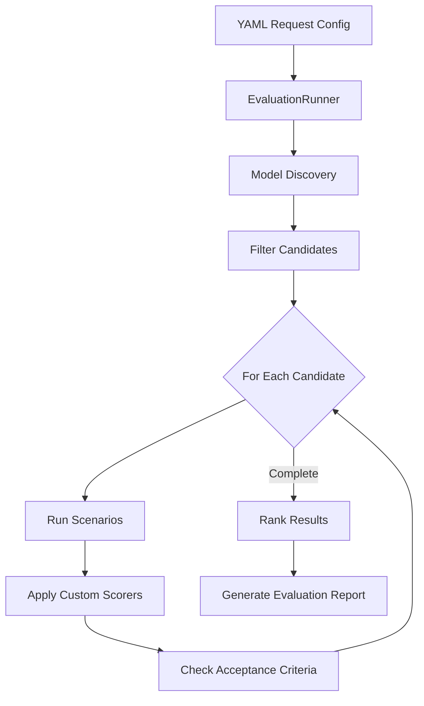
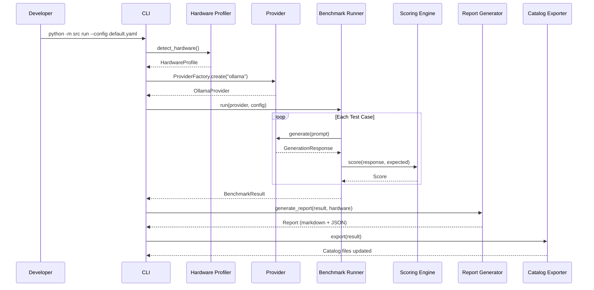

# System Architecture

> Technical architecture documentation for AI_Eval.
> Follows the [C4 Model](https://c4model.com/) with Mermaid.js diagrams.

---

## 1. System Context (C4 Level 1)

How AI_Eval fits into the broader ecosystem.

---

## 2. Container Architecture (C4 Level 2)

The logical modules that compose the system.

---

## 3. Key Design Decisions

Significant architectural choices and their rationale. Full details in [DevPlan.md](DevPlan.md) technical decisions.

| Decision | Choice | Why | Reference |
|----------|--------|-----|-----------|
| Provider abstraction | `BaseProvider` ABC + `ProviderFactory` | Decouple evaluation logic from inference backends; adding providers requires only implementing the interface | [TD-001](DevPlan.md) |
| Marker-based export | `<!-- AI_EVAL:BEGIN -->` / `<!-- AI_EVAL:END -->` delimiters | Update shared catalog files without overwriting manual annotations | [TD-003](DevPlan.md) |
| LLM-as-Judge bias mitigation | Position shuffling, self-evaluation prohibition, multi-eval consensus | Eliminate known biases in LLM judge evaluations | [TD-011](DevPlan.md) |
| Config-driven evaluation | YAML request configs with dataclass validation | Reproducible evaluations; configs stored alongside results | [TD-012](DevPlan.md) |
| Hardware-aware profiling | Auto-detect chip, memory, GPU at benchmark start | Ground results in the hardware that produced them for cross-machine comparison | [TD-006](DevPlan.md) |
| Scoring methodology | Three complementary approaches (pass@k, Judge, RAG) | Different evaluation tasks require different measurement methods | [TD-010](DevPlan.md) |

---

## 4. Data Flow

Primary data flow for a benchmark evaluation run.

### Evaluation Workflow Data Flow

---

## 5. Security Posture

| Concern | Approach |
|---------|----------|
| API Key Management | Environment variables via `.env` (gitignored); `.env.example` template provided |
| Code Execution | pass@k scorer runs generated code in sandboxed subprocess with timeout enforcement |
| PII Protection | `security_scan.sh` (10 phases) checks for names, emails, paths before commit |
| Data Sanitization | Test fixtures use only synthetic data; no real user data in tracked files |
| Dependency Scanning | `bandit` (static analysis), `pip-audit` (vulnerability DB), `safety` (CVE checks) |
| Pre-commit Hooks | black, ruff, isort, mypy, security scanner run automatically before each commit |
| CI Pipeline | GitHub Actions runs lint, type check, security scan, tests on every push |

See [SECURITY.md](SECURITY.md) for the full security policy.

---

## 6. Technology Stack

| Layer | Technology | Purpose |
|-------|-----------|---------|
| Language | Python 3.12+ | Primary implementation |
| CLI | argparse | Command-line interface |
| Local Inference | Ollama SDK | Local LLM model serving |
| Cloud Inference | google-genai SDK | Google Gemini API access |
| RAG Evaluation | DeepEval | RAGAS metrics (relevancy, faithfulness, precision) |
| Hardware Detection | psutil | Cross-platform system profiling |
| Templating | Jinja2 | Report generation |
| HTTP | httpx | Async HTTP client |
| Terminal Output | rich, tabulate | Colored CLI output |
| Testing | pytest | pytest-asyncio, pytest-cov, pytest-mock |
| Formatting | black (100 chars) | Code formatting |
| Linting | ruff, isort | Fast linting and import sorting |
| Type Checking | mypy | Static type analysis |
| Security | bandit, pip-audit, safety | Vulnerability scanning |
| CI/CD | GitHub Actions | Automated lint, test, security, build |

---

## 7. Component Interaction

Sequence diagram for a typical benchmark run.

---

*This document is updated when architectural decisions change.*
